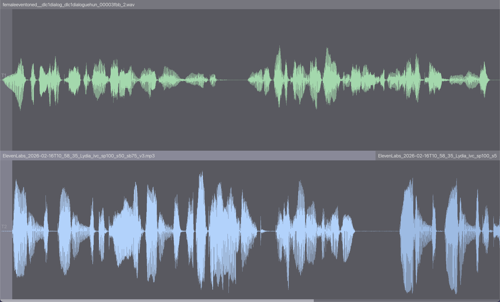

# Audio Editor

Audacity-style multi-track audio editor built from scratch with Rust, wgpu, and winit.



## Features

- Multi-track timeline with GPU-rendered waveforms
- Import MP3, WAV, and AAC audio files (drag & drop or Cmd+O)
- Non-destructive editing with full undo/redo
- Track mute/solo, selection, and clip manipulation
- WAV export (Cmd+E)
- Click track / metronome
- Project save/load

## Build & Run

Requires Rust 2024 edition (1.85+).

```
cargo run
```

## Stack

- **wgpu** — GPU rendering
- **winit** — windowing and input
- **cpal** — audio playback
- **symphonia** — audio decoding
- **glyphon** — text rendering
